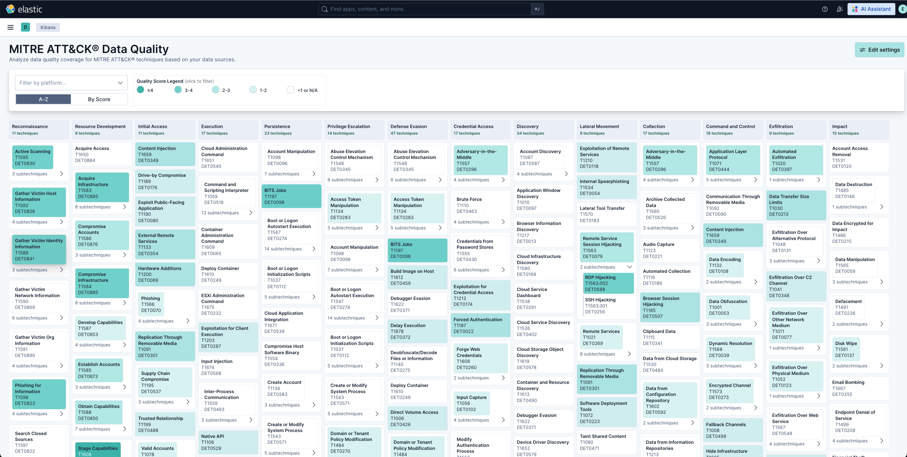
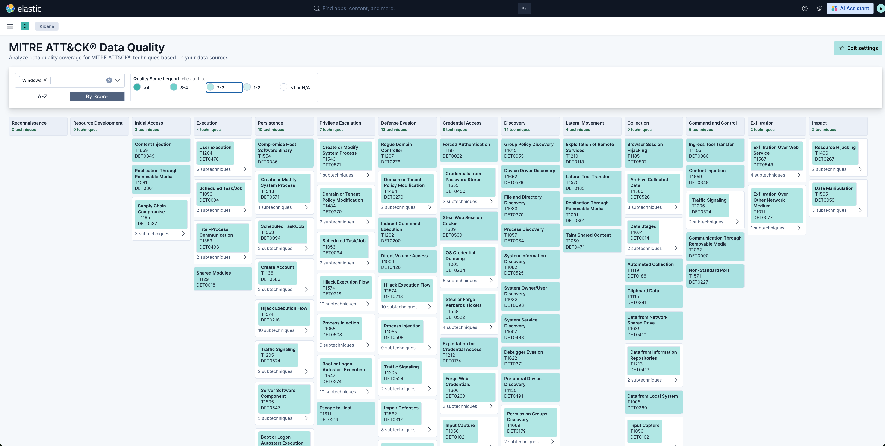
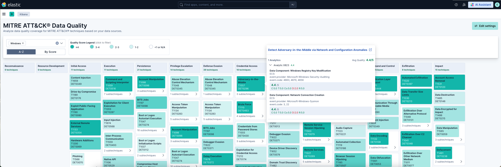

# MITRE ATT&CK® Data Quality Kibana Plugin

A Kibana plugin to assess and visualize data quality coverage for MITRE ATT&CK® techniques based on your data sources stored in Elasticsearch.

## Credits & Acknowledgments

This project is heavily inspired by and based on the excellent work from the **Rabobank DeTTECT project** ([https://github.com/rabobank-cdc/DeTTECT](https://github.com/rabobank-cdc/DeTTECT)). All scoring and data quality assessments use the same scoring tables defined by DeTTECT.

This Kibana plugin is also based on my previous work on **Log Alchemist** ([https://github.com/Seblhd/LogAlchemist](https://github.com/Seblhd/LogAlchemist)), a Python-based tool I developed with similar capabilities.

**Compatibility:** This plugin is compatible with **MITRE ATT&CK® Framework version 18** (latest).

**Scope:** Currently, this project covers only the **Data Quality** dimension. Visibility and other dimensions from DeTTECT are not yet implemented.

---

## Key Benefits

- **Automatically assess Data Quality** for data stored in Elastic (in `logs-*` indices)
- **Find which data is available in the SIEM** so:
  - SOC teams can identify blind spots and adapt their detection strategy
  - SOC teams can create new detection rules based on data availability
- **Assess SOC maturity** based on onboarded data and existing detection rules
- **Periodically check** if data is still existing in the SIEM

---

## Plugin Features & Screenshots

### Global Overview

The plugin provides an interactive MITRE ATT&CK® matrix view showing data quality scores for each technique and sub-technique.


*Animated demonstration of the MITRE Data Quality matrix interface and its features.*

### Data Quality Matrix - Full View


*Global view of the Data Quality Matrix showing all tactics and techniques without any filter applied.*

### Filtered View - Windows Platform


*Filtered view showing only Windows platform with techniques/sub-techniques where the score is between 2-3.*

### Technique Details


*Detailed view showing scores for each analytic in the detection strategy linked to techniques and sub-techniques.*

---

## Installation

### Prerequisites

You need to have the Kibana source code matching your Kibana version.

### Step 1: Clone Kibana and Switch to Your Version

```bash
git clone https://github.com/elastic/kibana.git kibana
cd kibana
git fetch --all --tags
git checkout v9.2.3
```

> **Note:** Replace `v9.2.3` with your actual Kibana version.

### Step 2: Build the Plugin

```bash
cd plugins
git clone https://github.com/Seblhd/mitre-data-quality-kibana-plugin mitre_data_quality
nvm use
yarn build
```

**Expected build output:**

```
yarn run v1.22.22
$ yarn plugin-helpers build
$ node ../../scripts/plugin_helpers build
? What version of Kibana are you building for? 9.2.3
 info deleting the build and target directories
 info building required artifacts for the optimizer
 info running @kbn/optimizer
 info compressing js and css bundles found at plugins/mitre_data_quality/build/kibana/mitreDataQuality/target/public to brotli
ERROR Error: ENOENT: no such file or directory, scandir '/Users/sebastien/Nybble-Dev/kibana/plugins/mitre_data_quality/build/kibana/mitreDataQuality/target/public'
 info copying assets from `public/assets` to build
 info copying server source into the build and converting with babel
 info running yarn to install dependencies
 info compressing plugin into [mitreDataQuality-9.2.3.zip]
 succ plugin archive created
```

### Step 3: Install the Plugin

**Option A: Install from local build**

```bash
bin/kibana-plugin install file:///local/path/to/mitreDataQuality-9.2.3.zip
```

**Option B: Install from GitHub releases**

You can also use the pre-built plugin available on GitHub:

```bash
bin/kibana-plugin install https://github.com/Seblhd/mitre-data-quality-kibana-plugin/archive/refs/tags/mitreDataQuality-9.2.3.zip
```

### Step 4: Access the Plugin

Once installed successfully, restart Kibana. You will be able to access the **MITRE Data Quality** plugin from the **Security** menu in Kibana.

---

## Future Work

- Allow user to edit ECS to MITRE mapping from settings

---

## Development

See the [Kibana contributing guide](https://github.com/elastic/kibana/blob/main/CONTRIBUTING.md) for instructions on setting up your development environment.

### Scripts

| Command | Description |
|---------|-------------|
| `yarn kbn bootstrap` | Install node_modules and setup dependencies |
| `yarn plugin-helpers build` | Create a distributable version of the plugin |
| `yarn plugin-helpers dev --watch` | Build plugin UI for development mode |

---

## License

Copyright 2025 Sebastien Lehuede

Licensed under the Apache License, Version 2.0 (the "License");
you may not use this file except in compliance with the License.
You may obtain a copy of the License at

    http://www.apache.org/licenses/LICENSE-2.0

Unless required by applicable law or agreed to in writing, software
distributed under the License is distributed on an "AS IS" BASIS,
WITHOUT WARRANTIES OR CONDITIONS OF ANY KIND, either express or implied.
See the License for the specific language governing permissions and
limitations under the License.

See the [LICENSE](LICENSE) file for the full license text.
